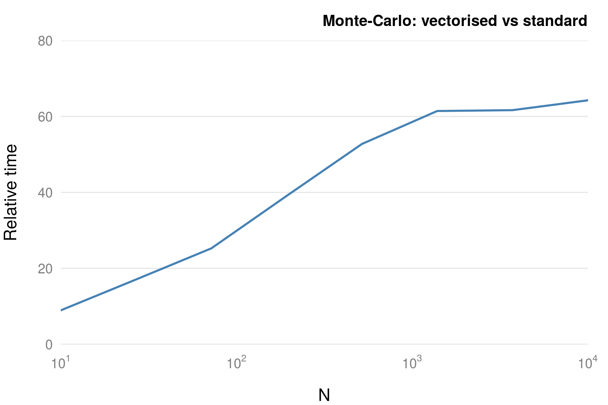
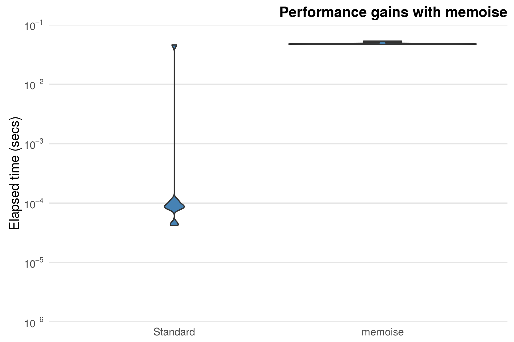

```{r echo=FALSE}
knitr::opts_chunk$set(
  comment = "#>",
  collapse = TRUE,
  cache = TRUE, 
  fig.align="center",
  fig.pos="t"
)
library(microbenchmark)
```

#### Exercise {-}

Use the **microbenchmark** package to compare the vectorised construct `x = x + 1`, to the
`for` loop version. Try varying the size of the input vector.

```{r}
add_vec = function(x) x + 1
add_for = function(x) {
  for(i in seq_along(x))
    x[i] = x[i] + 1
  x
}
## Notice the max values!
x = rnorm(10000)
microbenchmark(add_vec(x), add_for(x))

x = rnorm(10)
microbenchmark(add_vec(x), add_for(x))
```


#### Exercises {-}

1. Time the two methods for calculating the log sum. 
    ```{r}
    log_sum_for = function(x) {
      log_sum = 0
      for(i in 1:length(x))
        log_sum = log_sum + log(x[i])
      log_sum
    }
    log_sum_vec = function (x) {
      sum(log(x))
    }
    x = runif(1000) + 1
    microbenchmark(log_sum_for(x), log_sum_vec(x))
    ```
1. What happens when the `length(x) = 0`, i.e. we have an empty vector?

    ```{r, eval=FALSE}
    ## Raises an error
    x = c()
    log(x[0])
    ```

### Exercise {-}

Verify that `monte_carlo_vec()` is faster than `monte_carlo()`. How does this relate to 
the number of darts, i.e. the size of `N`, that is used

```{r, eval=FALSE}
monte_carlo = function(N) {
  hits = 0
  for (i in seq_len(N)) {
    u1 = runif(1)
    u2 = runif(1)
    if (u1 ^ 2 > u2)
      hits = hits + 1
  }
  return(hits / N)
}

monte_carlo_vec = function(N) sum(runif(N)^2 > runif(N))/N

n_s = seq(2, 4, length.out=6)
m = matrix(0, ncol=2, nrow = length(n_s))
for(i in seq_along(n_s)) {
  N = 10^(n_s[i])
  z = microbenchmark(monte_carlo(N), monte_carlo_vec(N), unit = "ms")
  z$time = z$time/10^9
  m[i,] = tapply(z$time, z$expr, mean)
}
  
plot(10^n_s, m[,1]/m[,2], log="x", type="l")
```

```{r echo=FALSE, out.width="60%"}

```

### Exercises {-}

The `stop()` function has an argument `call.` that indicates if the function call
should be part of the error message. Create a function and experiment with this option.

```{r}
f = function(call = FALSE)
    stop("An error has occured", call. = call)

#R> f(TRUE)
# Error in f(TRUE) : An error has occured
#R> f(FALSE)
# Error: An error has occured
```

#### Exercise {-}

Factors are slightly more space efficient than characters. Create a character vector
and corresponding factor and use `pryr::object_size()` to calculate the space needed for
each object.

```{r}
ch = sample(month.name, 1e6, replace = TRUE)
fac = factor(ch, levels = month.name)
pryr::object_size(ch)
pryr::object_size(fac)
```

#### Exercises {-}

1. Rewrite the `sapply()` function calls above using `vapply()` to ensure type consistency.
    ```{r, results="hide"}
two_cols = data.frame(x = 1:5, y = letters[1:5])
zero_cols = data.frame()
vapply(two_cols, class, FUN.VALUE = "character") # a list
vapply(zero_cols, class, FUN.VALUE = "character") # a list
```


1. How would you make subsetting data frames with `[` type consistent? Hint: look at
the `drop` argument.
    ```{r, results="hide"}
    two_cols[, 1:2, drop=FALSE]          # a data.frame
    two_cols[, 1, drop=FALSE]          
    ```

#### Exercise {-}

Construct a box plot of timings for the standard plotting function and the memoised
version. 


```{r, echo=FALSE, out.width="60%"}

```


#### Exercise {-}

1. Write a stop-watch function __without__ using function closures.

    This is quite hard. The solution below uses __reference classes__. These are 
    objects that are a combination of S4 objects and functions closures.
    ```{r, results="hide"}
    stop_watch = setRefClass("stop_watch", fields=list(start_time="POSIXt"))
    stop_watch$methods(
      list(
        start = function() {
          start_time <<- Sys.time()
        }, 
        stop = function() {
          stop_time = Sys.time()
          difftime(stop_time, start_time)
        }
      )
    )

    watch = stop_watch$new()
    watch$start()
    watch$stop()
    ```
1. Many stop-watches have the ability to measure not only your overall time but also you
individual laps. Add a `lap()` function to the `stop_watch()` function that will record
individual times, while still keeping track of the overall time.

    ```{r, results="hide"}
    stop_watch = function() {
      start_time = NULL
      lap_time = NULL
  
      start = function() {
        start_time <<- Sys.time()
        lap_time <<- start_time
      }
      stop = function() {
        stop_time = Sys.time()
        difftime(stop_time, start_time)
      }
      lap = function() {
        old_lap = lap_time
        lap_time <<- Sys.time()
        difftime(lap_time, old_lap)
      }
      list(start = start, stop = stop, lap = lap)
    }
    watch = stop_watch()
    watch$start()
    watch$lap()
    watch$stop()
    ```


