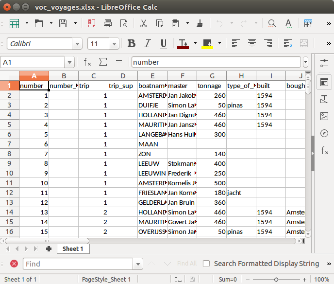

### Exercises {-}

1. The final line in the code chunk above shows a neat feature of **rio** and some other packages: the output format is determined by the suffix of the file-name, which make for concise code. Try opening the `voc_voyages.xlsx` file with an editor such as LibreOffice Calc or Microsoft Excel to ensure that the export worked, before removing this rather inefficient file format from your system:

    ```{r, results="hide", warning=FALSE}
    file.remove("voc_voyages.xlsx")
    ```
    
    To verify that the file saved as an Excel file correctly, try opening it, e.g. with LibreOffice, as illustrated below.
    
    
    ```{r}
    
    ```

2. Try saving the the `voyages` data frames into 3 other file formats of your choosing (see `vignette("rio")` for supported formats). Try opening these in external programs. Which file formats are more portable?

   To see the range of export options supported by **rio**, consult the documentation:
   
    ```{r}
    library(rio)
    ?export
    ```
    
    Three output options suported by the package are illustrated below:
    
    ```{r}
    export(cars, "cars.psv") # relatively unusual but highly portable
    export(cars, "cars.json") # portable web-friendly format
    export(cars, "cars.sav") # can be read-in by SPSS, not portable
    ```

3. As a bonus exercise, create a simple benchmark to compare the write times for the different file formats used to complete the previous exercise. Which is fastest? Which is the most space efficient?

    Of the above examples, .sav was the fastest:

    ```{r}
    library(microbenchmark)
    microbenchmark(times = 10,
        export(cars, "cars.json"), # portable web-friendly format
        export(cars, "cars.psv"), # relatively unusual but highly portable
        export(cars, "cars.sav") # can be read-in by SPSS, not portable
    )
    ```
    
    We can use `file.size()` to test the file size of the resulting files:
    
```{r}
    f_cars = list.files(pattern = "cars")
    knitr::kable(data.frame(
      Format = c(".json", ".psv", ".sav"),
      Size = file.size(f_cars)
    ))
    file.remove(f_cars) # remove excess files
    ```
